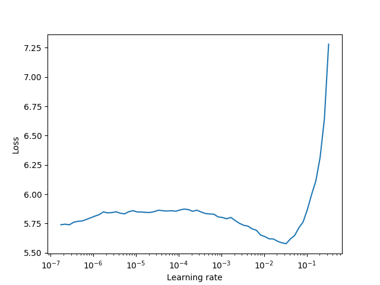
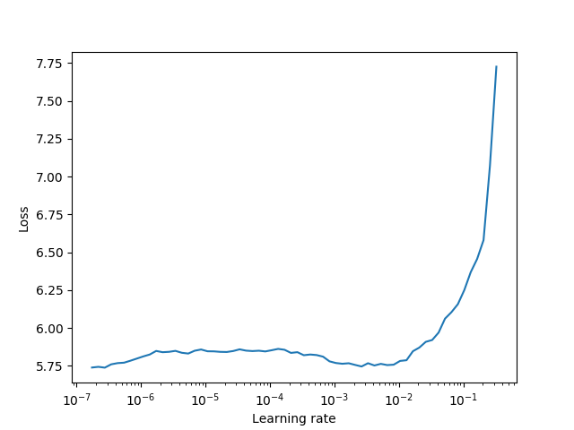

# fine-grained-image-classification

Fine grained image classification on the [Stanford Cars](http://ai.stanford.edu/~jkrause/cars/car_dataset.html) dataset. The model achieves ~91.4% accuracy on the test set.

# Model

To achieve a fair evaluation of the final model, the test set is not used at all at figuring out model architecture and hyper-parameters. They are chosen using a 20% validation set. Once they are decided, the model is trained again on the entire training+validation set and evaluated on the test set. The input images are initially sized at 224, but later increased to 299. The [fastai](https://github.com/fastai/fastai) library is used to do data augmentation.

A good learning rate is estimated between stages by plotting the loss vs learning rate. We pick learning rates at areas where the loss is decreases at the highest rate.

**Frozen Resnext model**



**Resnext model**



The model is trained on a frozen (except BN layers) [resnext50](https://arxiv.org/abs/1611.05431) model for 20 epochs and then finetuned with discriminative learning rates for 40 epochs. The model uses 3e-4, 1e-4, 3e-3 as learning rates for each third of the model. After this, the training images are increased to 299 and the model is retrained for another 40 epochs.

The [AdamW](https://arxiv.org/abs/1711.05101) implementation of Adam is used together with the [One Cycle Policy](https://arxiv.org/abs/1803.09820) as it is seen that training results are much better and converges faster.

**Things that I couldn't get to work**

Since google just released [EfficientNet](https://ai.googleblog.com/2019/05/efficientnet-improving-accuracy-and.html), I attempted to replace the resnext50 with this [EfficientNet implementation](https://github.com/lukemelas/EfficientNet-PyTorch). However I was only able to reach ~89% accuracy on the validation set. 

Some notes:

* Model reached 85%+ much quicker than resnet50 and resnext50. However it was unable to break the 90% threshold. I believe more careful finetuning can lead to better results.


# Installation

Clone repository

```
git clone https://github.com/vivekkalyan/fine-grained-image-classification.git
cd fine-grained-image-classification
```

Setup virtual environment

```
virtualenv -—python=python3 env
. env/bin/activate
```

Download and extract data

```
make
```

# Reproduce results

`run.py` file has the parameters used to train the final model that achieves ~91.4% accuracy.

```
python run.py
```

# Test on new data

A test script is provided to test on the "hold-out" data.

In the `test.py` file, update the folder of the images (`folder`), the csv file (`labels_csv`) and the model (`train.load_checkpoint()`). 

Note: if the csv has a different format, you will to specify which column the labels are in (`label_col`)

# Appendix

Experimental Results

| exp | model          | epochs |      acc | onecycle | frozen |        lr | fa data |   wd | dsc_lr |
|-----+----------------+--------+----------+----------+--------+-----------+---------+------+--------|
|   3 | resnet18       |     10 |     0.40 | no       | yes    |      3e-3 | no      | 1e-2 |        |
|   4 | resnet18       |     10 |     0.50 | no       | yes    |      3e-3 | yes     | 1e-2 |        |
|   8 | resnet18       |     10 |     0.45 | yes      | yes    |      3e-3 | no      | 1e-2 |        |
|  11 | resnet18       |     10 |     0.57 | yes(fa)  | yes    |      3e-3 | yes     | 1e-2 |        |
|  12 | resnet18       |     10 |     0.55 | yes      | yes    |      3e-3 | yes     | 1e-2 |        |
|  17 | resnet18       |     10 |    0.585 | yes(fa)  | yes    |    4.5e-3 | yes     | 1e-2 |        |
|  22 | resnet50       |     20 |     0.60 | yes      | yes    |      1e-2 | yes     | 1e-2 |      3 |
|  22 | resnet50       |  20+40 |     0.76 | yes      | yes+no | 1e-2+3e-3 | yes     | 1e-2 |      3 |
|  28 | resnet50       |     10 |     0.70 | yes      | yes    |      3e-3 | yes     | 1e-2 |        |
|  32 | resnet152      |     10 |     0.62 | no       | yes    |      3e-3 | yes     | 1e-2 |        |
|  33 | resnet101      |     10 |     0.74 | yes      | yes    |      3e-3 | yes     | 1e-2 |        |
|  36 | resnet101      |     20 |     0.76 | yes      | yes    |      1e-2 | yes     | 1e-2 |      3 |
|  36 | resnet101      |  20+40 |     0.84 | yes      | yes    | 1e-2+3e-3 | yes     | 1e-2 |      3 |
|  84 | resnet50       |     20 |     0.80 | yes      | yes    |      1e-2 | yes     | 1e-3 |      3 |
|  84 | resnet50       |  20+40 |     0.86 | yes      | yes+no | 1e-2+3e-3 | yes     | 1e-3 |      3 |
|  84 | resnet50       |  20+40 |    0.897 | yes      | yes+no | 1e-2+3e-3 | yes     | 1e-3 |      3 |
|  86 | resnet50       |     20 |     0.76 | yes      | yes    |      1e-2 | yes     | 1e-3 |     10 |
|  86 | resnet50       |  20+40 |     0.81 | yes      | yes+no | 1e-2+3e-3 | yes     | 1e-3 |     10 |
|  94 | resnext50      |  20+40 | **0.91** | yes      | yes+no | 1e-2+3e-3 | yes     | 1e-3 |      3 |
| 112 | efficientnetb3 |  20+40 |     0.89 | yes      | yes+no | 1e-2+3e-3 | yes     | 1e-3 |      3 |

